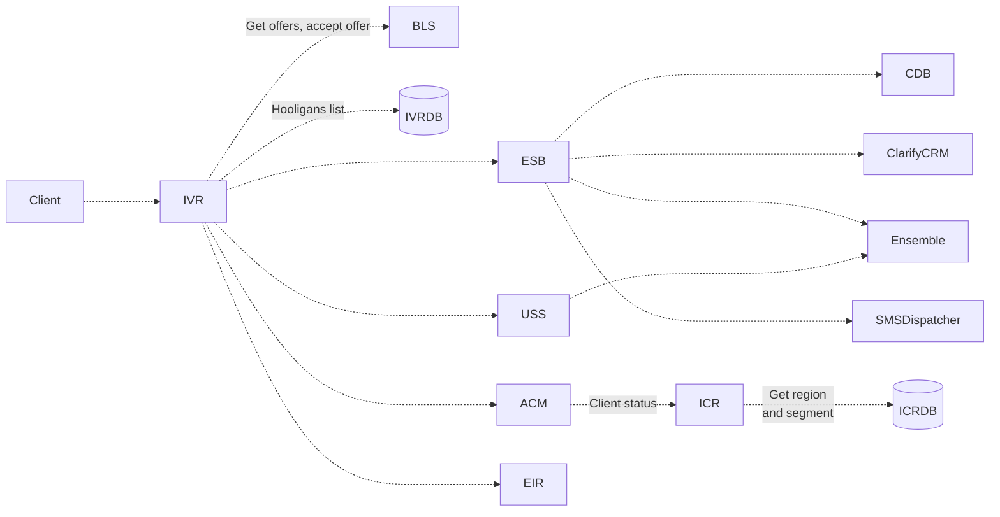
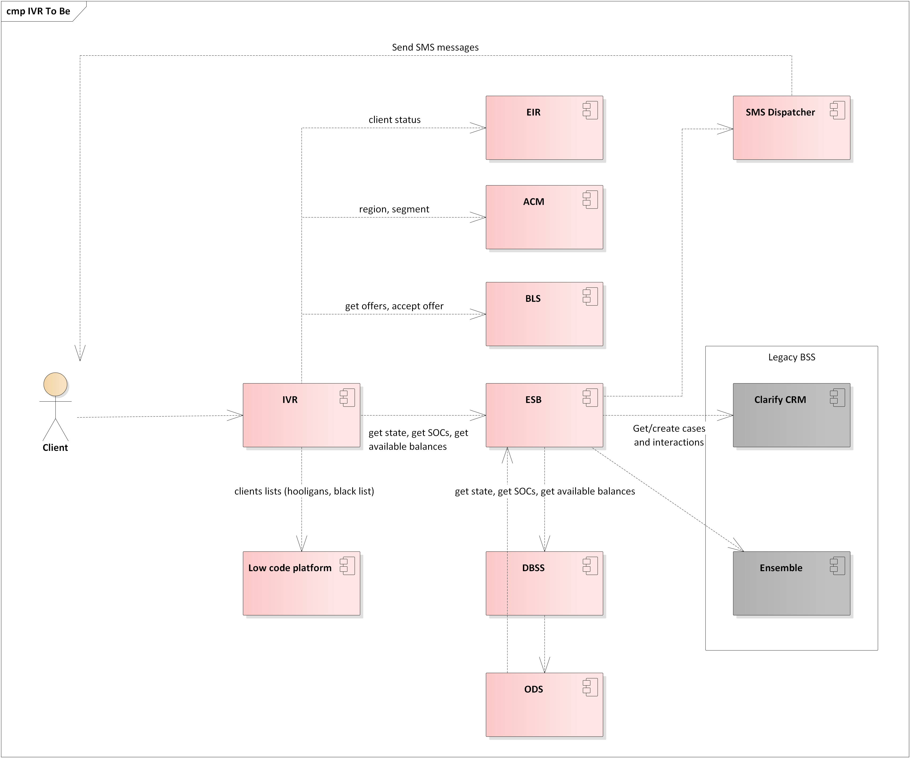
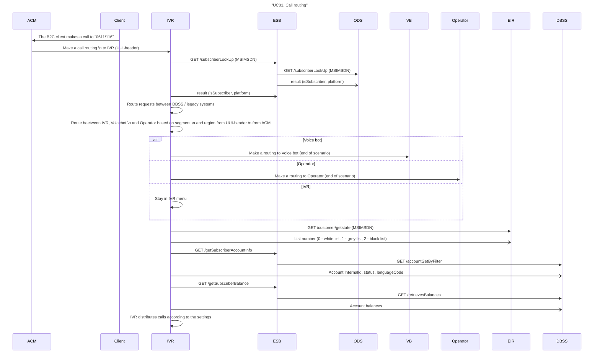

# KZ - 54. HL IS IVR

Создатель Краснов Олег

## Table of content

- [KZ - 54. HL IS IVR](#kz---54-hl-is-ivr)
  - [Table of content](#table-of-content)
- [Versions](#versions)
- [Participants](#participants)
- [Glossary](#glossary)
- [Purpose and scope](#purpose-and-scope)
- [Assumptions](#assumptions)
  - [Description of Assumption attributes:](#description-of-assumption-attributes)
- [Architecture decisions](#architecture-decisions)
- [Integration architecture](#integration-architecture)
  - [TO-BE Architecture](#to-be-architecture)
    - [Architecture Description](#architecture-description)
      - [As Is component diagram](#as-is-component-diagram)
      - [To Be component diagram](#to-be-component-diagram)
- [IDDS](#idds)
  - [UC01. Call routing](#uc01-call-routing)
    - [Sequence diagram](#sequence-diagram)
    - [Identified requirements](#identified-requirements)
  - [UC02. Greeting and language selection](#uc02-greeting-and-language-selection)
    - [Sequence diagram](#sequence-diagram-1)
    - [Identified requirements](#identified-requirements-1)
- [Open questions](#open-questions)

# Versions

| Date       | Author       | Description   | Approved version copy | Approvers |
| ---------- | ------------ | ------------- | --------------------- | --------- |
| 22.12.2022 | Oleg Krasnov | Initial draft | -                     | -         |

# Participants

| Role                              | Member                       |
| --------------------------------- | ---------------------------- |
| Kar-Tel SPOC                      | Krasnov Oleg, Kim Evgeniy    |
| Amdocs SPOC                       | Anfimov Victor, Baykov Ravil |
| Document status                   | In analisys                  |
| Kar-Tel review business team      | Shif Sergey, Mikhel Svetlana |
| KaR-Tel review business test team | -                            |
| KaR-Tel review test team          | -                            |
| Kar-Tel review IDD                | Shif Sergey                  |
| Related VON                       | -                            |
| Related documentation             | -                            |

# Glossary

# Purpose and scope

This document describes how IVR will interact to DBSS as a part of VEON KZ/UZ. The description below valid for Technical Proof, Phase 2, Phase 3, all phases.

# Assumptions

The section contains all assumption as well as exclusions, restrictions VEON and Amdocs agreed on while preparing this document.

- If parties are uncertain on something at the moment of writing the document, but need to align to move forward they make Assumption.
- If parties agree to exclude something from discussion/architecture/scope such Exclusion should be recorded in the table below.
- If there is a detail that affects the solution and it’s not under control of either party, VEON and Amdocs, they may wish to add it to the table below as Restriction.

## Description of Assumption attributes:

1. ID - unique identifier of Assumption. Should be created using Requirement Yogi (Alt+Shift+R). Naming conventions KZ-ASMP-<SEQ>.
1. State - New, Validated, Cancelled.
   Description - Assumption's description. It should clearly state what it is about and consequences of having it valid/invalid.
1. Phase - all phases to which Assumption is applicable should be enumerated. Possible values:
   - TPR - Technical Proof.
   - Prepaid - Mobile Prepaid.
   - Postpaid - Mobile postpaid
   - Combination of those divided by commas.
1. Components affected - list of components affected by this assumption. Component names should be taken from Component registry.

Assumption should be created in the KZ - 1. Assumptions registry and then inserted in the table below.

| #   | Assumption | Comments |
| --- | ---------- | -------- |
| 1   | -          | -        |

# Architecture decisions

This section contains the list of Architecture decisions. If parties have agreed on the topic that affects the solution (components, interfaces, data) or there are several options to choose between, they may record the final agreement in the table below. This kind of agreement is referred to as Architecture Decision hereafter.

**Description of Architecture decisions attributes:**

1. ID - unique identifier of Architecture decision. Should be created using Requirement Yogi (Alt+Shift+R). Naming conventions KZ-ARCH-<SEQ>.
1. State - New, Validated, Cancelled.
1. Description - Architecture decision's description. It should clearly state what it is about and, if there were several options, why one of them is preferred over others.
1. Components affected - the list of components affected by this Architecture decision. Component names should be taken from Component registry.
1. Phase - all phases to which Architecture decision is applicable should be enumerated. Possible values:
   - TPR - Technical Proof.
   - Prepaid - Mobile Prepaid.
   - Postpaid - Mobile postpaid
   - Combination of those divided by commas

Architecture decisions should be created in the KZ - 2. Architecture decisions registry and then inserted in the table below.

| #   | Architecture decision | Comments |
| --- | --------------------- | -------- |
| 1   | -                     | -        |

# Integration architecture

## TO-BE Architecture

### Architecture Description

#### As Is component diagram

<details>
    <summary>As Is component diagram (<i>click to expand</i>)</summary>



  </details>

#### To Be component diagram



# IDDS

## UC01. Call routing

### Sequence diagram

| Name                | Description            |
| ------------------- | ---------------------- |
| Involved components | Client, IVR, ESB, DBSS |
| Note                | Client, IVR, ESB, DBSS |
| Postconditions      | -                      |
| Preconditions       | -                      |
| Initiated           | -                      |



**Basic steps:**

1. The B2C client makes a call to 0611/116
1. IVR receives data about the client segment and region
1. Route requests between DBSS / legacy systems
1. Route beetween IVR, Voicebotand Operator based on segment and region 1. from UUI-header from ACM
1. IVR distributes calls according to the settings

**Alternative steps:**

### Identified requirements

| #   | Required changes | Components | Phase | Use Case | Jira |
| --- | ---------------- | ---------- | ----- | -------- | ---- |
| 1   | -                | -          | -     | -        | -    |

---

> #### The quarterly results look great!
>
> - Revenue was off the chart.
> - Profits were higher than ever.
>
>   _Everything_ is going according to **plan**.

## UC02. Greeting and language selection

### Sequence diagram

| Name                | Description            |
| ------------------- | ---------------------- |
| Involved components | Client, IVR, ESB, DBSS |
| Note                | Client, IVR, ESB, DBSS |
| Postconditions      | -                      |
| Preconditions       | -                      |
| Initiated           | -                      |

**Sequence Diagram**

**Basic steps:**

1. The B2C client makes a call to 0611/116
1. IVR receives data from "172.28.93.132:1521", "KZCDB"

- The language is selected – IVR welcomes and voices the selected language, offers to press the button to change the language
- The client did not press anything – the transition to the next block
- The client has chosen a different language – IVR serves in the selected language
  - Language not selected – IVR serves in the selected language

**Alternative steps:**

### Identified requirements

| #   | Required changes | Components | Phase | Use Case | Jira |
| --- | ---------------- | ---------- | ----- | -------- | ---- |
| 1   | -                | -          | -     | -        | -    |

```ruby
# The Greeter class
class Greeter
  def initialize(name)
    @name = name.capitalize
  end

  def salute
    puts "Hello #{@name}!"
  end
end

# Create a new object
g = Greeter.new("world")

# Output "Hello World!"
g.salute
```

```yaml
{ "this-json": "looks awesome..." }
```

> [!WARNING]
> Dangerous certain consequences of an action.

# Open questions

- [x] #739
- [ ] https://github.com/octo-org/octo-repo/issues/740
- [ ] Add delight to the experience when all tasks are complete :tada:
